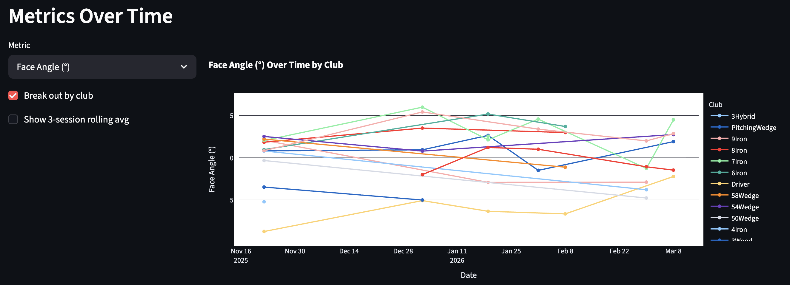
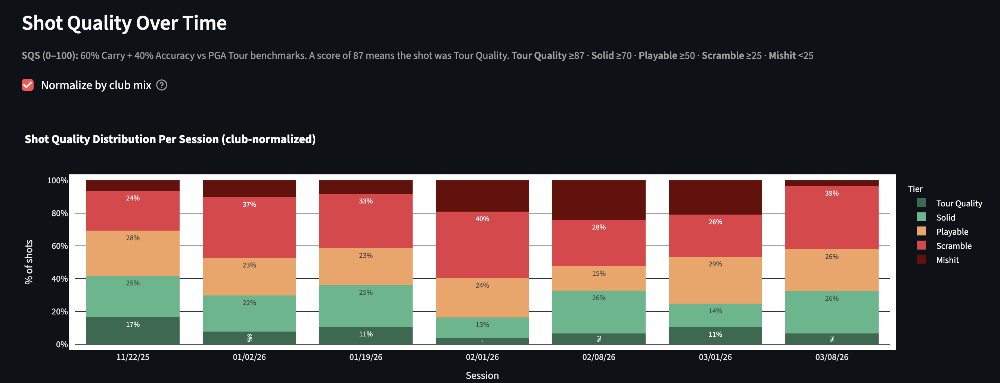
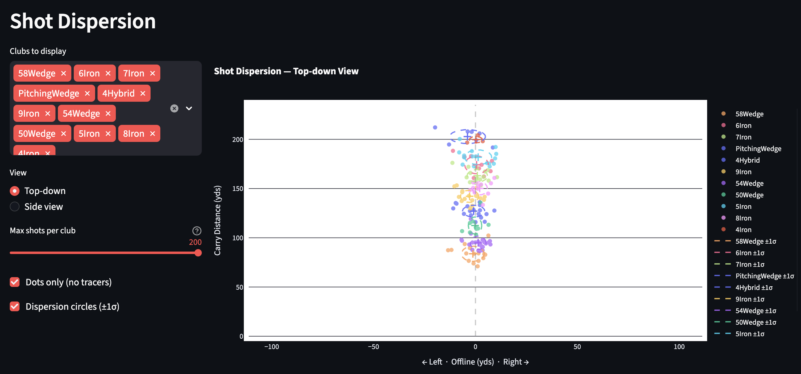
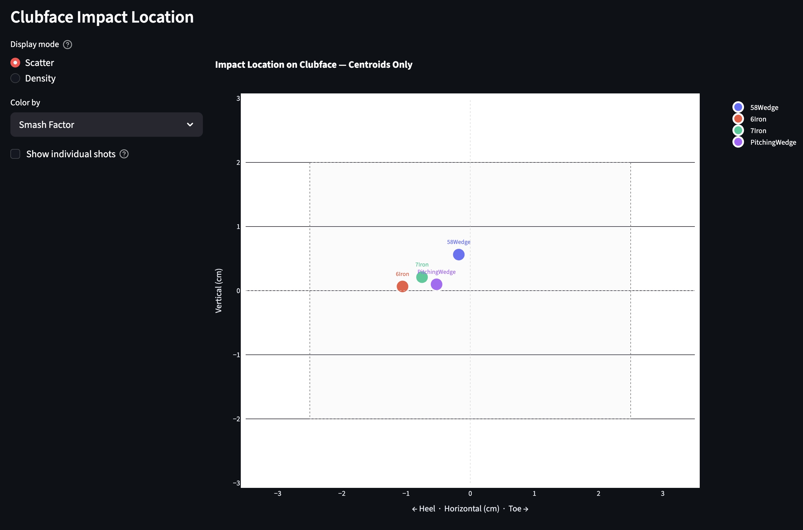
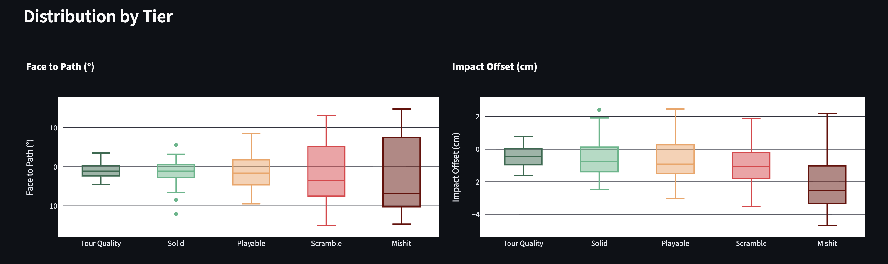

# Trackman Shot Analysis

An analytics dashboard for [Trackman](https://www.trackman.com/) golf data. Syncs your shot history from the Trackman portal, scores every shot against PGA Tour benchmarks, and visualizes everything in an interactive Streamlit app.

**Try it now:** [trackman-shot-analysis.streamlit.app](https://trackman-shot-analysis.streamlit.app/) — paste your Trackman activity URLs, no install required.

---

## Features

- **Shot Quality Score (SQS)** — 0–100 scoring system benchmarked against PGA Tour averages for carry distance and accuracy
- **Sessions overview** — session history with avg SQS, personal records panel, and one-click CSV export
- **Trends** — metrics over time, shot quality distribution per session, avg SQS trend by club with configurable rolling average
- **Session detail** — per-session shot log with manual exclusion, scatter plot explorer, shot sequence chart, and session comparison
- **Club stats** — side-by-side club averages table, clubface impact location chart (aggregate and scatter modes)
- **Shot dispersion** — carry-only top-down and side-view trajectory charts with ghost tracers, ±1σ dispersion ellipses, and fixed axis scaling
- **Quality analysis** — heatmap, distribution charts, and metric correlations with SQS, with optional tier grouping
- **Cloud mode** — paste Trackman activity URLs directly in the browser for instant analysis, no install or account needed

---

## Screenshots

**Shot quality breakdown per session**


**Metrics over time by club**


**Shot dispersion — top-down view with ±1σ ellipses**


**Clubface impact location — centroids per club**


**Swing metric distribution by quality tier**


---

## Metrics tracked

| Category | Metrics |
|---|---|
| Speed | Club Speed (mph), Ball Speed (mph), Smash Factor |
| Launch | Launch Angle, Launch Direction, Attack Angle |
| Spin | Total Spin (rpm), Spin Axis, Dynamic Loft |
| Shape | Club Path, Face Angle, Face to Path |
| Distance | Carry (yds), Total Distance (yds), Offline (yds), Peak Height (yds) |
| Impact | Descent Angle, Impact Offset (cm), Impact Height (cm) |

---

## Shot Quality Score (SQS)

```
SQS = (0.60 x Carry Score) + (0.40 x Accuracy Score)
```

**Carry Score** — actual carry vs PGA Tour average for that club, on a power curve (exponent 1.4). 100% of tour carry = 100. 50% or below = 0.

**Accuracy Score** — absolute offline distance scaled to club-specific PGA Tour dispersion. Dead straight = 100. Scales down through four zones (tight / tour average / wide / extreme).

| Tier | SQS |
|---|---|
| Tour Quality | 87-100 |
| Solid | 70-86 |
| Playable | 50-69 |
| Scramble | 25-49 |
| Mishit | 0-24 |

Benchmarks are fixed PGA Tour numbers, not derived from your personal data, so scores are consistent and comparable across sessions and golfers.

---

## Quick start (cloud)

No install required. Visit [trackman-shot-analysis.streamlit.app](https://trackman-shot-analysis.streamlit.app/), paste one or more Trackman activity URLs, and click **Load Sessions**.

To get your activity URLs: open [portal.trackmangolf.com](https://portal.trackmangolf.com), navigate to a session, and copy the URL from your browser's address bar. Data is processed in your browser session only and is not stored anywhere.

---

## Local setup

For persistent data storage and faster loading, run the dashboard locally.

### Requirements

- Python 3.11+
- A [Trackman portal](https://portal.trackmangolf.com) account

### Install

```bash
git clone https://github.com/steve-moretti/Trackman-analysis.git
cd Trackman-analysis

python -m venv .venv
source .venv/bin/activate       # macOS / Linux
.venv\Scripts\activate          # Windows

pip install -r requirements.txt
playwright install chromium
```

### Sync your data

Run after each range session:

```bash
python sync.py
```

A Chrome window opens. Log in with your Trackman account. Your session is saved to `data/browser_session.json` so you only need to log in once. All sessions and shots are stored in `data/trackman.db`.

To force a full re-sync of every session:

```bash
python sync.py --all
```

### Launch the dashboard

```bash
streamlit run app.py
```

Opens at [http://localhost:8501](http://localhost:8501).

---

## Project structure

```
app.py                  # Streamlit dashboard
cloud_fetch.py          # Cloud mode — fetch data from Trackman API
sync.py                 # Local sync script (Playwright + REST API)
db.py                   # SQLite layer
requirements.txt
data/
  trackman.db           # Your shot database (gitignored)
  browser_session.json  # Saved login session (gitignored)
  raw/                  # Raw API responses for debugging
```

---

## How sync works

1. A browser window opens and you log into your Trackman account
2. The sync script reads your session list from the network responses the portal loads
3. Each session's shot data is fetched from Trackman's public report endpoint
4. Speeds are converted from m/s to mph; distances from meters to yards

**Supported activity types:** Only **Shot Analysis** sessions are synced. Other activity types (virtual rounds, simulated courses, etc.) are silently skipped during sync.

---

## Troubleshooting

**No data showing** — Run `python sync.py` first.

**Login expired** — Delete `data/browser_session.json` and re-run `python sync.py`.

**New session not appearing** — Click **Refresh data** in the sidebar or restart the app.

**Missing metrics** — Some shots (topped balls, chips) may have incomplete Trackman data. Those shots will have blank fields for the affected metrics.

---

## Privacy

**Local mode:** All data is stored on your machine. Nothing is sent anywhere beyond the Trackman API calls needed to fetch your own data.

**Cloud mode:** Data flows directly from Trackman's API to your browser session. Nothing is stored on the server. Close the tab and the data is gone.

---

## Disclaimer

This is an independent personal project and is not affiliated with, endorsed by, or associated with Trackman A/S in any way. Trackman is a registered trademark of Trackman A/S. This tool accesses only your own data using your own credentials and is intended for personal use.
